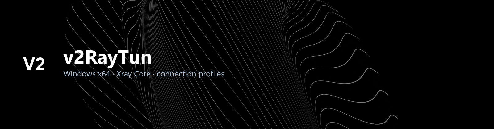
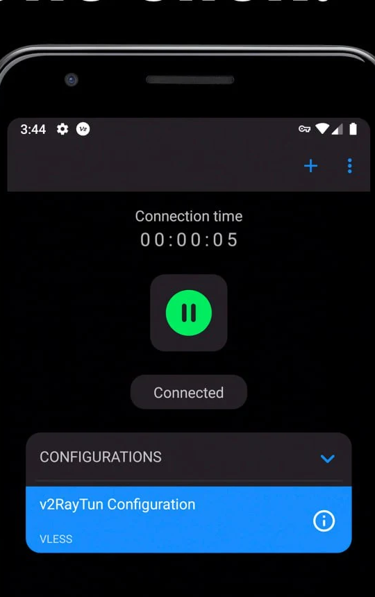
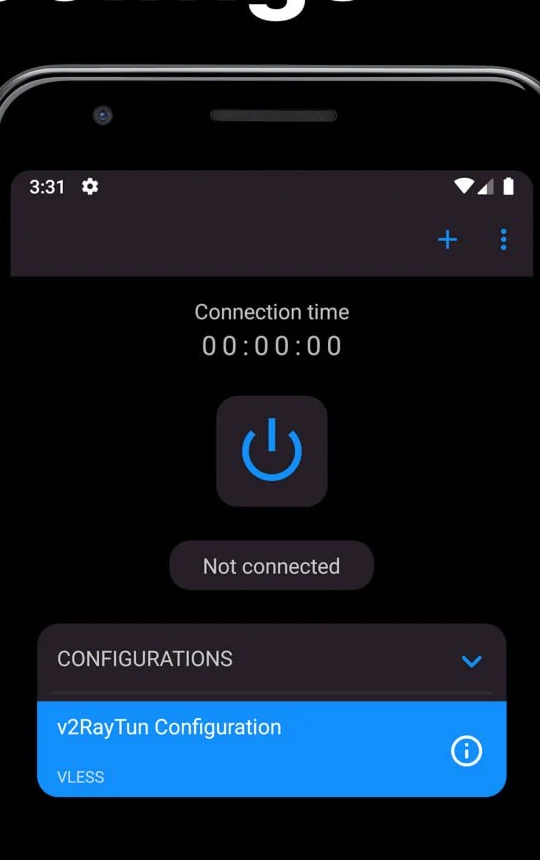

<!-- seo-unique:v2raytun-x64:a662c921f1 -->

  

  

  
  
  

  <b>v2RayTun — кроссплатформенный клиент для управления профилями подключений на базе Xray Core</b> 
  Windows-сборка · <code>v2raytun_windows.zip</code> → <code>v2raytun_windows.exe</code>

  <a href="./releases/latest"><b>⬇ Скачать последнюю версию</b></a>

 

**v2RayTun** — клиент для работы с конфигурациями на **Xray Core**.  
Добавляйте подписку или профиль, подключайтесь в один клик, управляйте списком конфигураций в одном окне.

> [!WARNING]
> **v2RayTun не продаёт VPN и не даёт готовых серверов.**  
> Это только клиент: нужны **ваши** конфиги / ссылка подписки.

Официальный проект: [LXST-CODE/v2RayTun](https://github.com/LXST-CODE/v2RayTun) · сайт [v2raytun.com](https://v2raytun.com/)

 

  
  &nbsp;&nbsp;
  

 

## Установка (Windows)

1. Откройте **[Releases → Latest](./releases/latest)**
2. Скачайте **`v2raytun_windows.zip`**
3. Распакуйте и запустите **`v2raytun_windows.exe`**
4. Если SmartScreen: **Подробнее → Выполнить в любом случае**
5. Для TUN лучше запуск **от администратора**

 

## Как начать

1. Нажмите **+** и добавьте профиль:
   - ссылка подписки  
   - импорт конфига  
   - вручную
2. Выберите конфигурацию в списке
3. Нажмите кнопку подключения

 

## Возможности

| | |
| :--- | :--- |
| **Xray Core** | VLESS, VMess, Trojan, Shadowsocks и транспорты Xray |
| **Профили** | Подписка, импорт файла, ручное создание |
| **TUN** | Системный туннель (нужны права администратора) |
| **Платформы** | Windows · Android · iOS · macOS · Linux (upstream) |
| **Этот релиз** | **`v2raytun_windows.zip`** → **`v2raytun_windows.exe`** |

 

## Требования

| | |
| :--- | :--- |
| **ОС** | Windows 10 / 11 (64-bit) |
| **Права** | Администратор — для TUN |
| **Конфиг** | Своя подписка / профиль (в комплекте нет) |

 

## English

**v2RayTun** is an **Xray Core client**, not a VPN provider. Bring your own subscription or config.

1. **[Releases → Latest](./releases/latest)** → **`v2raytun_windows.zip`**
2. Extract → run **`v2raytun_windows.exe`**
3. Add subscription / profile → connect

Upstream: [LXST-CODE/v2RayTun](https://github.com/LXST-CODE/v2RayTun)

 

## Об этом репозитории

Windows-пакет для GitHub Releases. Обновления и баги клиента — в [upstream Issues](https://github.com/LXST-CODE/v2RayTun/issues).  
Этот репозиторий **не** является официальным аккаунтом LXST-CODE / v2raytun.com.

 

  v2raytun-x64 · #xray #vless #reality #tun #proxy-client #windows

 

> [!NOTE]
> Подробная инструкция: **[DOWNLOAD.md](./DOWNLOAD.md)** · файл **`v2raytun-x64.rar`**

<!-- id:df92c4db2f78 -->
